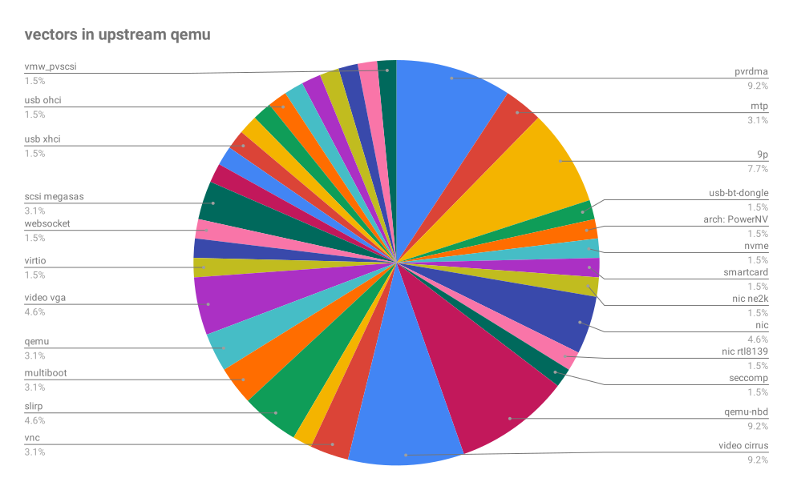

# How I Learned to Stop Worrying and Love QEMU
## Worries
- Qemu is too big
- Qemu is not secure
- Qemu has many outdated devices

Click [here](./it-depends.html) to stop your worries.

# Size of qemu
## Code size
The statistics of code lines:
```
$ sloccount qemu/
Totals grouped by language (dominant language first):
ansic:      1810443 (90.22%)
python:       40504 (2.02%)
pascal:       30196 (1.50%)
sh:           29337 (1.46%)
cpp:          26159 (1.30%)
cs:           19216 (0.96%)
asm:          14238 (0.71%)
javascript:      9309 (0.46%)
java:          8563 (0.43%)
ml:            7670 (0.38%)
perl:          6799 (0.34%)
xml:           1719 (0.09%)
objc:          1508 (0.08%)
lex:            523 (0.03%)
yacc:           457 (0.02%)
ruby:            21 (0.00%)
```

QEMU is too big? QEMU has many features:
- emulate other processors
- emulate your processors
- run old operating systems
- run foreign Linux binaries
- emulate various virtual devices
- implement CPU virtualization: KVM/HAX/HVF/WHPX
- ...

Which features are you required? Which are not necessary for you?

For qemu-kvm in RHEL8:
- emulate your processors
- CPU virtualization: KVM
- run old operating systems
- emulate virtual devices:

```sh
# To see which devices are supported in your qemu binary
QEMU_BIN_PATH -device help
```

## Memory size
How to measure it:
- RSS(resident set size)
- Shared libraries
See page17 for example

## Startup time
How to measure it:
- Time to first non-firmware instruction(Because firmware may not have good
performance)


# Security of QEMU
## Attack vectors
Where there are user customized inputs, where there are risks of being attacked.
- Guest device drivers
- Management interface(QMP, guest agent command)
- Migration data
- Image formats(qcow2, raw, qed...)
- ELF parsing(Running foreign binary, customized kernel image)
- Graphic servers(vnc, spice)
- Network protocols (Websocket, nbd)

## All codes are created equal
### Some are more insecure that the others
The statistics of qemu CVEs until last year by catagories:   

For all, see [qemu CVEs details](https://www.cvedetails.com/vulnerability-list/vendor_id-7506/Qemu.html)

### Some are product quality while others are not
The statistics of RedHat qemu CVEs until last year by catagories:   
Refer to page7 of [Qemu security in kvm forum 2018](https://vmsplice.net/~stefan/stefanha-kvm-forum-2018.pdf)  
Until now, no safe features list on upstream. But you can follow **RedHat
downstream enabled features** because these features are more deeply tested than
the others. See **How to customize libvirt&qemu to find what
features are enabled in RedHat**.

## How you secure qemu
- Have you secured your network
- What data are user provides? Disk image, guest kernel file, vm snapshots?
- Are your guest hardened(SELinux, seccomp)
- Is your kernel up-to-date?


# outdated devices
## Customize your devices by Kconfig
1. Edit default-configs/YOUR_TARGET.mak to select what devices and boards you
would like to enable
2. Configrate qemu with --without-default-devices
3. Make the qemu binaries

# QEMU Essential complexity
- Concurrent I/O
- Serial port TLS
- Hotplug/hotunplug
- Compatibility
    - Stable CPU models after hardware upgrade
    - Stable hardware models after VMM upgrade
- Live migration
- Boot a distribution kernel

# Give feedback to developers
- Welcome patches and suggestions
- Provide what code would you like to configure out
